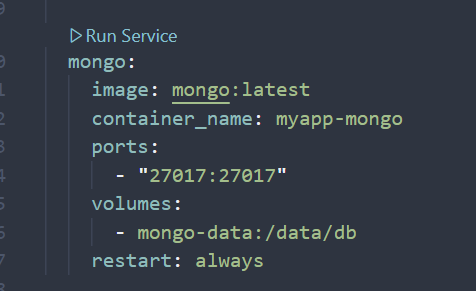

# Setup Instructions

This document outlines the steps to set up the blockchain, backend server, and related components for the project.

## 1. Blockchain Setup

1.  Navigate to the blockchain directory:

    ```bash
    cd <the-proj-root>/Blockchain
    ```

2.  Install dependencies:

    ```bash
    npm install
    ```

3.  Compile and Start the Hardhat local node:
    *   **Important:** Keep this terminal window open while developing.
    *   Compile contracts:
        ```bash
        npx hardhat compile
        ```
    *   Start the local node:
        ```bash
        npx hardhat node
        ```
    *   **Take Note:** Copy one of the **Private Keys** listed in the output (e.g., for Account #0: `0xac097...`). You will need this for MetaMask.

4.  Deploy contracts (in a **new** terminal window):
    *   Navigate to the blockchain directory again:
        ```bash
        cd <the-proj-root>/Blockchain
        ```
    *   Deploy the contracts to the running local network:
        ```bash
        npx hardhat run scripts/deploy.ts --network localhost
        ```
    *   This script will also copy necessary ABI files to the frontend project.

    there are output address of the coin and campaign smart contract address in the log after running the deploy script. Please set up .env for both FE and BE

## 2. Backend Server and Database Setup

This section details setting up the Node.js backend server and MongoDB for managing off-chain data. You can choose either Docker-based setup OR manual setup.

**Before proceeding, create a `.env` file in the `BE` directory based on the `.env.example` file and configure the necessary environment variables.** Ensure `RPC_URL` is set correctly (e.g., `RPC_URL=http://host.docker.internal:8545` for Docker setup if Hardhat runs on host, or `RPC_URL=http://127.0.0.1:8545` for manual setup).

### 2a) Docker-Based Setup 

1.  Navigate to the project root directory:

    ```bash
    cd <the-proj-root>
    ```

2.  Start the Docker containers:

    ```bash
    docker-compose up --build
    ```

    This command builds the Docker images and starts the containers for the backend server and MongoDB. Keep this terminal running.

### 2b) Manual Setup (Recommended)

1.  Ensure you have a local MongoDB instance running (e.g., by starting the `mongo` service from the Docker Compose file at <the-proj-root>).


2.  Navigate to the backend directory:

    ```bash
    cd <the-proj-root>/BE
    ```

3.  Install dependencies:

    ```bash
    npm install
    ```

4.  Start the backend server

    *   Using `npm`:

        ```bash
        npm run dev:tsnode
        ```

    Keep this terminal running.

## 3. Frontend Setup

**Before proceeding, create a `.env.local` file in the frontend directory (`FE`) based on the `.env.example` file and configure the necessary environment variables (like `NEXT_PUBLIC_...` contract addresses).**

1.  Navigate to the frontend directory:

    ```bash
    cd <the-proj-root>/FE
    ```

2.  Install dependencies:

    ```bash
    npm install
    ```

3.  Start the development server:

    ```bash
    npm run dev
    ```

## 4. MetaMask Configuration (Crucial for Frontend Interaction)

To interact with the deployed smart contracts from the frontend application, your MetaMask browser extension needs to be connected to the local Hardhat network and use one of its pre-funded test accounts.

### 4a) Add Hardhat Network to MetaMask

1.  Open the MetaMask extension in your browser.
2.  Click on the network dropdown menu at the top (usually says "Ethereum Mainnet").
3.  Select "Add network".
4.  Choose "Add a network manually".
5.  Fill in the network details:
    *   **Network name:** `Hardhat Localhost` (or any name you prefer)
    *   **New RPC URL:** `http://127.0.0.1:8545`
    *   **Chain ID:** `1337`
    *   **Currency symbol:** `ETH` (or `GO`)
    *   **Block explorer URL (Optional):** Leave blank
6.  Click "Save".

### 4b) Import a Hardhat Test Account

1.  Go back to the terminal where you ran `npx hardhat node`.
2.  Copy one of the **Private Keys** listed (e.g., `0xac0974bec39a17e36ba4a6b4d238ff944bacb478cbed5efcae784d7bf4f2ff80`). **Never share real private keys! These are only for local testing.**
3.  In MetaMask, click the account circle icon at the top right.
4.  Select "Import account".
5.  Paste the copied **Private Key** into the field.
6.  Click "Import". You should see the account added with a balance of 10000 ETH (or GO).

### 4c) Connect to the Application

1.  In MetaMask, ensure the **Hardhat Localhost** network is selected from the network dropdown.
2.  Ensure the newly **imported account** (e.g., Account 2, Account 3, etc.) is selected as the active account.
3.  Navigate to your running frontend application (usually `http://localhost:3000`).
4.  When prompted by the application (or by clicking a "Connect Wallet" button), approve the connection request in MetaMask.

You are now set up to interact with the smart contracts on your local Hardhat network through the frontend application using a test account.
